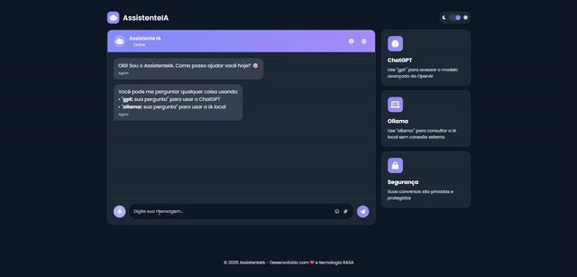

# RasaGPT 🤖

RasaGPT é um assistente de conversação avançado que combina o poder do framework Rasa com modelos de linguagem como ChatGPT (via API) e Ollama (localmente). Este projeto permite criar um chatbot com interface web elegante que pode:

- Processar intenções básicas de conversação
- Conectar-se à API do OpenAI para usar o ChatGPT
- Integrar-se ao Ollama para processamento local de IA
- Oferecer uma interface web responsiva e amigável



## 📋 Pré-requisitos

Antes de começar, você precisará ter instalado:

- Python (3.8 ou superior)
- Node.js e npm (para desenvolvimento frontend, opcional)
- Ollama (opcional, para processamento local de IA)

## 🚀 Instalação

### 1. Clone o repositório

```bash
git clone https://github.com/seu-usuario/rasagpt.git
cd rasagpt
```

### 2. Configure um ambiente virtual Python

```bash
# Crie um ambiente virtual
python -m venv venv

# Ative o ambiente virtual
# No Windows
venv\Scripts\activate
# No macOS/Linux
source venv/bin/activate
```

### 3. Instale o Rasa e dependências

```bash
pip install rasa==3.6.2
pip install rasa-sdk==3.6.0
pip install openai requests
```

### 4. Configure a API do OpenAI (opcional, mas recomendado para usar o ChatGPT)

```bash
# No Windows
set OPENAI_API_KEY=sua-chave-api-aqui

# No macOS/Linux
export OPENAI_API_KEY=sua-chave-api-aqui

# Para tornar permanente, adicione ao seu arquivo .bashrc, .zshrc ou similar
```

### 5. Instale o Ollama (opcional, para processamento local de IA)

Siga as instruções oficiais de instalação em [Ollama.ai](https://ollama.ai)

Depois de instalar o Ollama, baixe um modelo como o Llama 2:

```bash
ollama pull llama2
```

## ⚙️ Configuração

### Treine o modelo Rasa

```bash
cd rasagpt
rasa train
```

Este comando cria um modelo com base nos dados de treinamento e configuração em `data/` e `config.yml`.

## 🏃‍♂️ Executando o Projeto

Para execução completa, você precisará iniciar três componentes:

### 1. Inicie o servidor de ações personalizadas

```bash
# Em um terminal
cd rasagpt
rasa run actions
```

### 2. Inicie o servidor Rasa principal

```bash
# Em outro terminal
cd rasagpt
rasa run --enable-api --cors "*"
```

### 3. Inicie a interface web

```bash
# Em um terceiro terminal
cd rasagpt/webtest
python -m http.server 8080
```

Agora, acesse http://localhost:8080 no seu navegador para interagir com o RasaGPT.

## 🔍 Uso do Assistente

Após iniciar todos os componentes, você poderá conversar com o assistente através da interface web:

- Para conversa regular: Digite qualquer mensagem normalmente
- Para usar o ChatGPT: Digite `gpt: sua pergunta` ou `pergunte ao gpt: sua pergunta`
- Para usar o Ollama (IA local): Digite `ollama: sua pergunta` ou `pergunte ao ollama: sua pergunta`

Exemplos:
- "Olá, como vai?"
- "gpt: Explique a teoria da relatividade de Einstein"
- "ollama: Quais são as melhores práticas para desenvolvimento Python?"

## 🧩 Estrutura do Projeto

```
rasagpt/
├── .rasa/                   # Cache e arquivos de sessão Rasa
├── actions/                 # Ações personalizadas
│   └── actions.py           # Código das ações personalizadas (ChatGPT/Ollama)
├── data/                    # Dados de treinamento
│   ├── nlu.yml              # Exemplos de intenções e entidades
│   ├── rules.yml            # Regras de conversação
│   └── stories.yml          # Fluxos de conversa
├── models/                  # Modelos treinados do Rasa
├── tests/                   # Testes automatizados
├── webtest/                 # Interface web
│   ├── index.html           # Página principal
│   ├── style.css            # Estilos CSS
│   └── script.js            # Lógica de frontend
├── config.yml               # Configuração do pipeline Rasa
├── credentials.yml          # Configurações dos canais
├── domain.yml               # Definições de intenções, ações e respostas
└── endpoints.yml            # Configuração de endpoints
```

## 📝 Personalizando o Assistente

### Adicionando novas intenções

Para adicionar novas intenções, edite o arquivo `data/nlu.yml`:

```yaml
nlu:
  - intent: nova_intencao
    examples: |
      - exemplo 1
      - exemplo 2
      - exemplo 3
```

### Adicionando novas respostas

Para adicionar novas respostas, edite o arquivo `domain.yml`:

```yaml
responses:
  utter_nova_resposta:
    - text: "Esta é uma nova resposta"
```

### Criando novas regras ou histórias

Para adicionar comportamentos, edite `data/rules.yml` ou `data/stories.yml`.

### Treinando novamente

Após fazer alterações, treine novamente o modelo:

```bash
rasa train
```

## 🔧 Solução de Problemas

### CORS (Cross-Origin Resource Sharing)

Se encontrar erros de CORS, verifique:

1. O arquivo `credentials.yml` está configurado corretamente:
```yaml
rest:
  url: http://localhost:5005/webhooks/rest/webhook
  cors: "*"
```

2. Inicie o Rasa com a flag `--cors`:
```bash
rasa run --enable-api --cors "*"
```

### API do OpenAI

Se o ChatGPT não estiver funcionando:

1. Verifique se a variável de ambiente `OPENAI_API_KEY` está configurada
2. Verifique os logs do servidor de ações para erros
3. Verifique se o modelo especificado em `actions.py` está disponível

### Ollama

Se o Ollama não estiver respondendo:

1. Verifique se o serviço Ollama está em execução
2. Verifique se você baixou o modelo especificado em `actions.py` (padrão: llama2)
3. Tente executar `ollama list` para ver os modelos disponíveis

## 📚 Recursos Adicionais

- [Documentação do Rasa](https://rasa.com/docs/rasa/)
- [Documentação da API OpenAI](https://platform.openai.com/docs/)
- [Documentação do Ollama](https://ollama.ai/blog/ollama-is-now-available)

## 🤝 Contribuindo

Contribuições são bem-vindas! Sinta-se à vontade para abrir issues ou enviar pull requests.

## 📄 Licença

Este projeto está licenciado sob a licença MIT - veja o arquivo LICENSE para detalhes.

## 🙏 Agradecimentos

- [Rasa](https://rasa.com/) pelo incrível framework de chatbot
- [OpenAI](https://openai.com/) pela API do ChatGPT
- [Ollama](https://ollama.ai/) por tornar os LLMs acessíveis localmente
